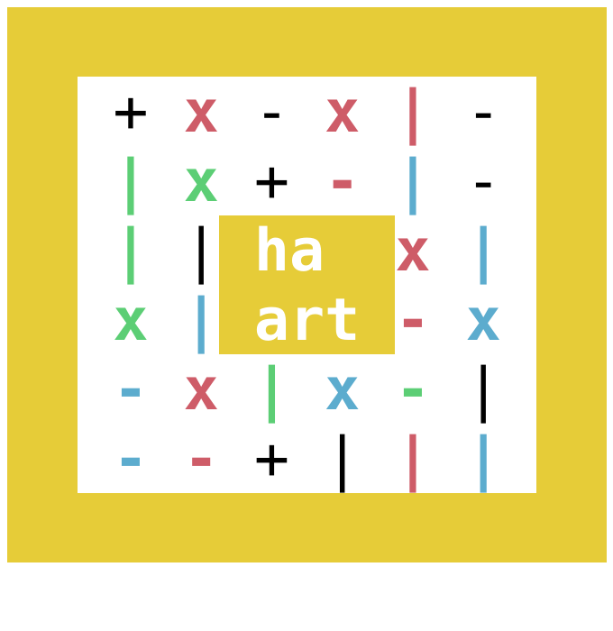

# Haart
Generate ascii art from file hashes. 

Haart uses MD-5 Checksums to generate a unique hash from the file provided as input, and converts that to a nice looking ascii art image. 

Here is the generated ascii art for `haart.js`

### Usage
**Flags:**
- `-h`, `--help`: show help message
- `-v`, `--version`: show current version of program.
- `-i`, `--input`: specify the input file to be hashed
- `-o`, `--output`: specify the output file (if any) to save the ascii art to
- `-f`, `--format`: specify the format to create, currently `ascii`, `img` and `html` are avialable. Image exporting uses `node-snapshot` and `phantomjs` to create an image from the HTML. Exporting is tested with PNG and JPEG image files.

### Roadmap
- create option to generate checksums for directories, possibly by creating a tarball. Useful for comparing metadata as well as file contents.
- add theme support
- push to npm